

  <h1 style="margin: 0; color: white;">2025-12-13 Re:set 2026 활동 결과</h1>

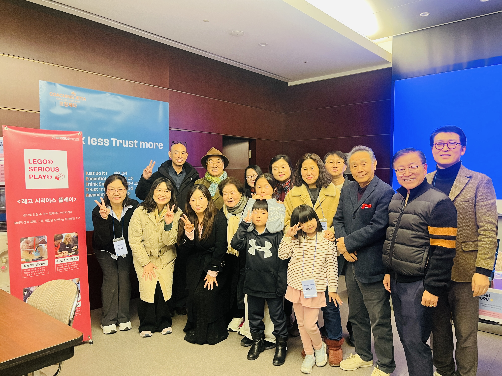

> ## **2026 새해맞이 첫걸음**  
> ##### **여유있는 삶 연말 특별 워크숍**

---

## Ⅰ. 행사 개요

| 구분 | 내용 |
|------|------|
| **행사명** | Re:set2026 모임 후기 |
| **행사 성격** | 연말연시 코칭제타 워크숍 |
| **일시** | 2025년 12월 13일 (토) 14:00 ~ 16:00 (2H) |
| **장소** | 서울 도곡타워팰리스 C동 1층 주민회의실 |
| **주최** | 코칭제타 |

| **목적** | 올해 열심히 달려온 나, 잘 보내주고 있나요? 2025년을 훈훈하게 기억하고, 2026년을 의미있게 설계하는 특별한 자리에 모십니다 

| **주요 강연자** | 티쿤글로벌 권대욱 회장 | 더마크월드 송성원 대표 | 터득골북샵 나무선 대표
| **운영 스태프** | 타마 코치, 여유코치 | **운영 책임** | 코칭제타 |

---

## Ⅱ. 주요 활동 내용

Re:set2026은 여유있는 삶 커뮤니티를 중심으로 한 해를 되돌아보는 성찰의 시간과 단단한 결심으로 새해를 맞이하는 여러 조별 활동으로 구성된 코칭프로그램으로 진행하였습니다.

### 1. 전체 프로그램 순서

<iframe src="../images/2026진행PT.pdf" width="100%" height="600px" style="border: 1px solid #ddd; border-radius: 8px;" class="pdf-iframe"></iframe>

📥 <a href="../images/2026진행PT.pdf" target="_blank">프로그램 자료 다운로드</a>

---

**Part 1: 2025년 나는...**  
올 한 해 나를 대표하는 물건을 통해서 내가 달려온 일 년을 돌아보고 스토리를 참가자들과 공유하는 시간을 가졌습니다. 그리고 권대욱 대표님의 특강을 통해 '가슴 뛰는 삶'에 대해 인사이트를 얻었습니다.

**Part 2: 2026년 나를...**  
2025년을 발판으로 새해를 리셋하며 나의 삶을 새롭게 디자인 하는 시간을 터득골 나무선 님과 함께 다짐해보았습니다. 또한 그런 나의 모습을 레고시어리어스 프로그램을 통해 인생 네컷으로 나누어 그려보았습니다.

### 2. 특별강연: **「가슴 뛰는 삶」- 티쿤글로벌 권대욱 회장**

<iframe width="100%" height="450" src="https://www.youtube.com/embed/loqJi2RcPZo?si=IfN4Bep-JBqIYxgQ" title="YouTube video player" frameborder="0" allow="accelerometer; autoplay; clipboard-write; encrypted-media; gyroscope; picture-in-picture; web-share" allowfullscreen style="border-radius: 8px; margin: 20px 0;"></iframe>

🎥 [YouTube에서 보기](https://youtu.be/loqJi2RcPZo?si=IfN4Bep-JBqIYxgQ)

### 3. 특별강연: **「삶디자인」- 터득골북샵 나무선 대표**

<iframe src="../images/삶디자인.pdf" width="100%" height="600px" style="border: 1px solid #ddd; border-radius: 8px;" class="pdf-iframe"></iframe>

📥 <a href="../images/삶디자인.pdf" target="_blank">삶디자인 자료 다운로드</a>

---

### 3. 생각활동: **「LSP 체험」- 레고시어리어스 코리아 송성원 대표**

<iframe src="../images/LSP체험_송성원.pdf" width="100%" height="600px" style="border: 1px solid #ddd; border-radius: 8px;" class="pdf-iframe"></iframe>

📥 <a href="../images/LSP체험_송성원.pdf" target="_blank">LSP 체험 자료 다운로드</a>

---

## Ⅲ. 행사 결과 및 평가

### 1. 참여 현황

  

    <h3>22명</h3>
    
총 신청자

  

  

    <h3>20명</h3>
    
실제 참석

  

  

    <h3>90.9%</h3>
    
참석률

  

| 구분 | 계획 | 신청 | 실제 |
|------|------|------|------|
| **총계** | 22명 | 20명 | 참석률: 90.9% |

---

### 2. 현장 사진

<strong>📋 활동지</strong>

<iframe src="../images/2026리셋 워크북.pdf" width="100%" height="600px" style="border: 1px solid #ddd; border-radius: 8px;" class="pdf-iframe"></iframe>

<strong>🏷️ 명찰</strong>

<iframe src="../images/2026리셋명찰.pdf" width="100%" height="600px" style="border: 1px solid #ddd; border-radius: 8px;" class="pdf-iframe"></iframe>

*테이블 별 세팅(명찰 및 종이, 노트, 간식, 펜 / 1인당 1개)*

<strong>📸 활동 사진</strong>

  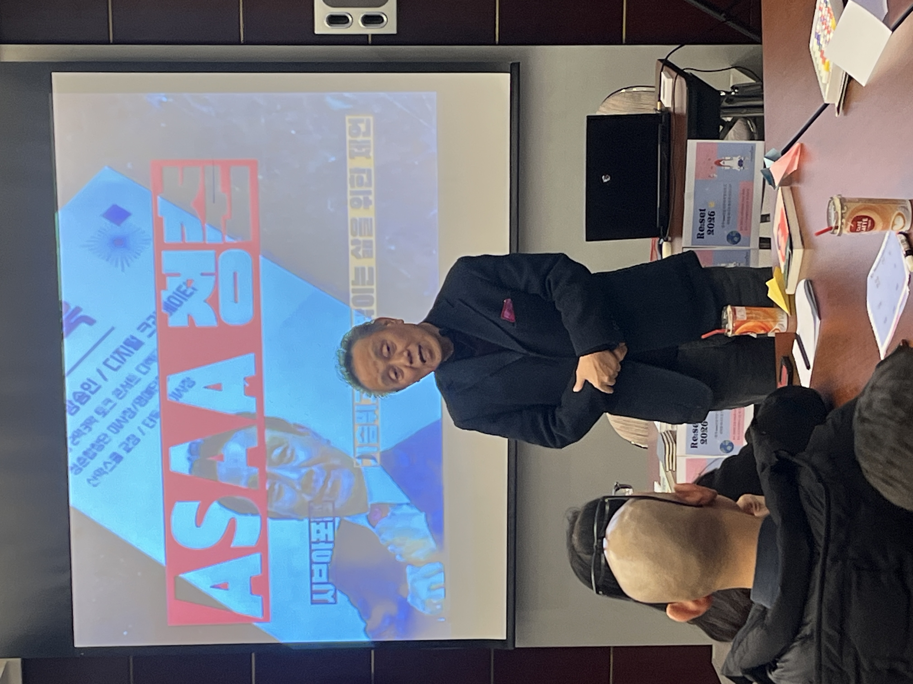
  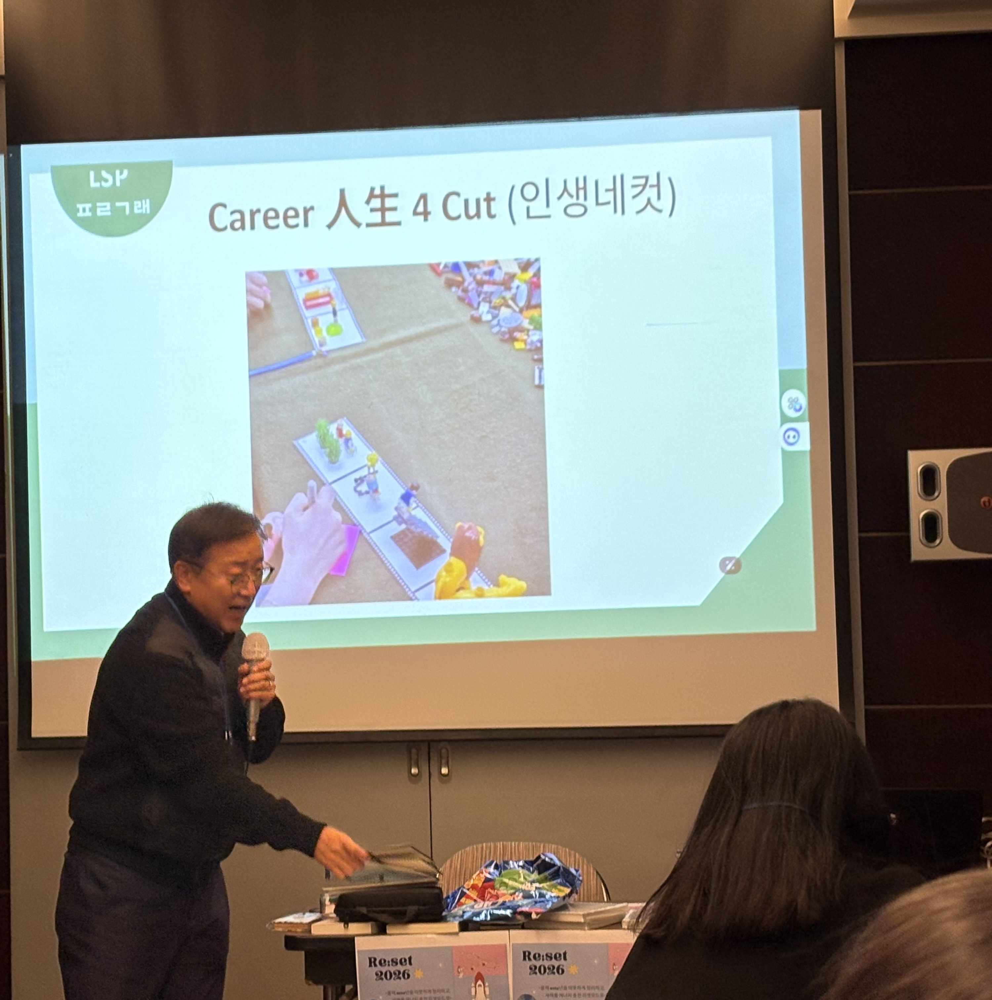
  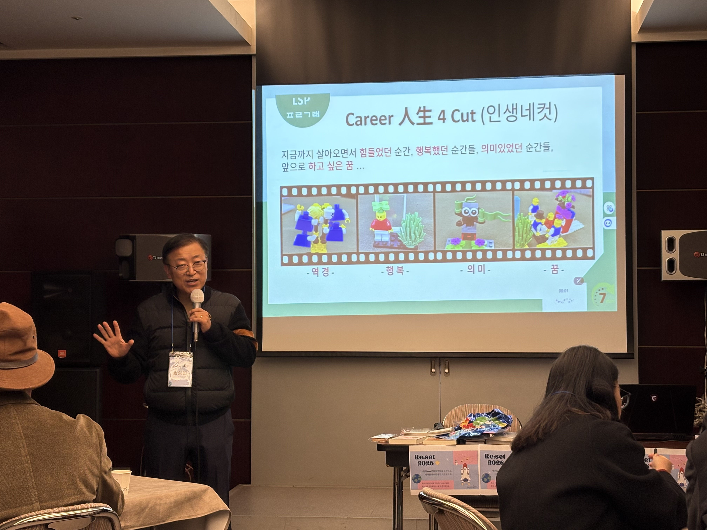
  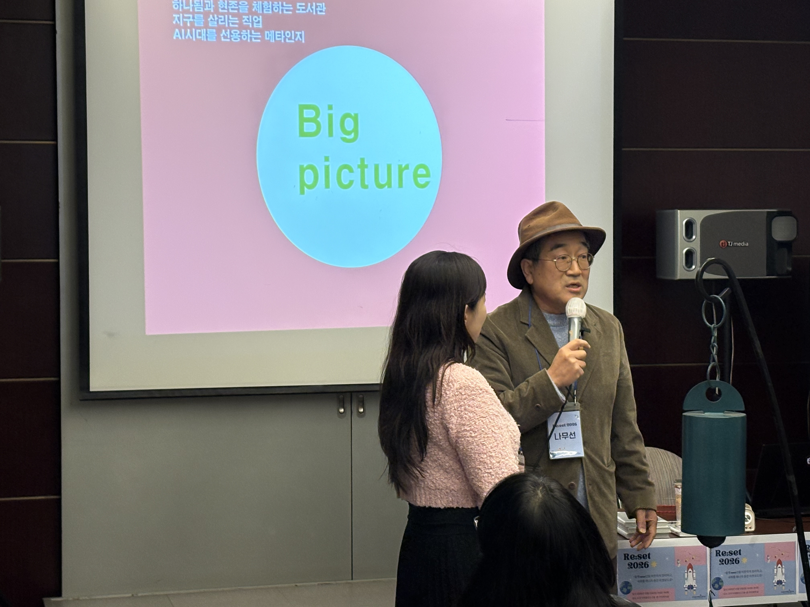
  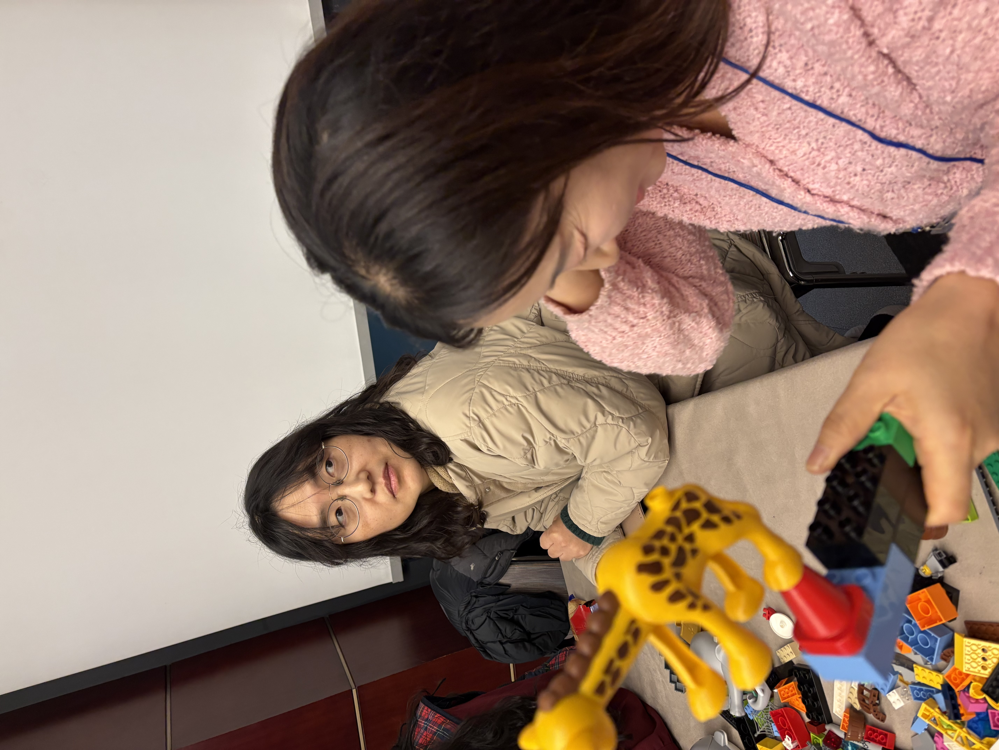
  
  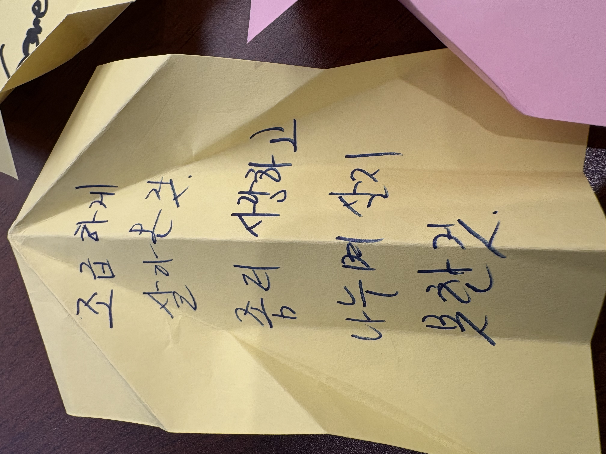
  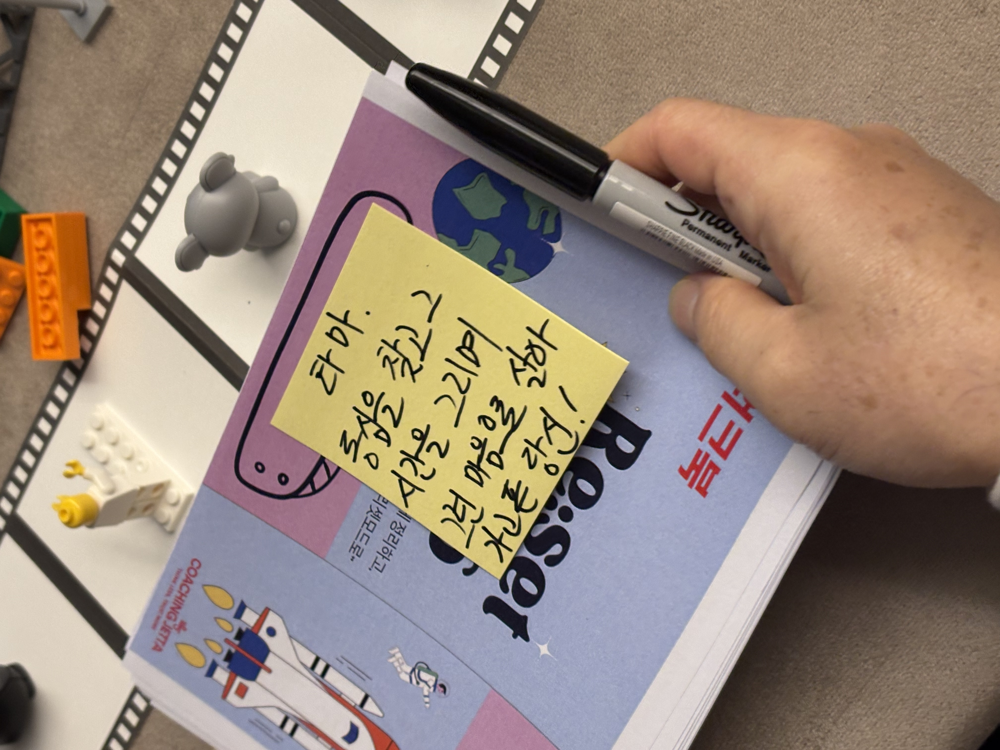
  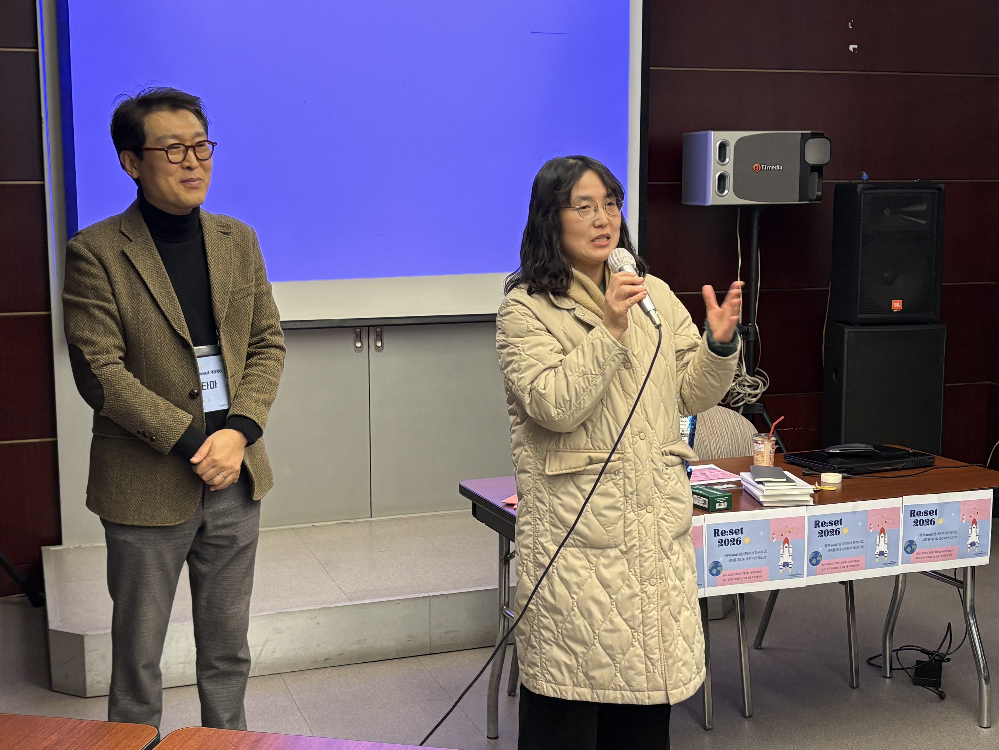
  
  
  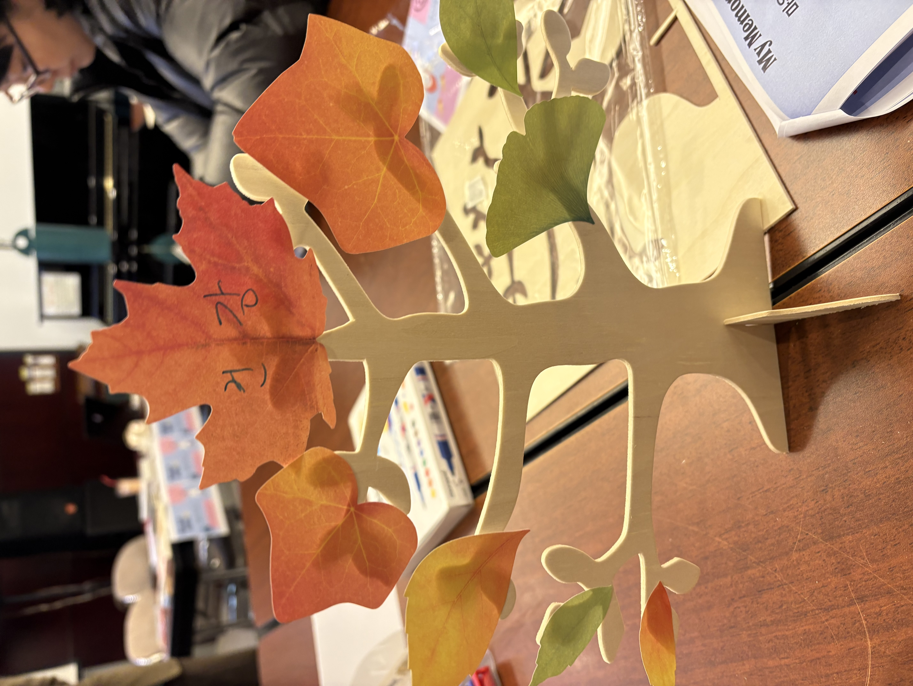
  
  
  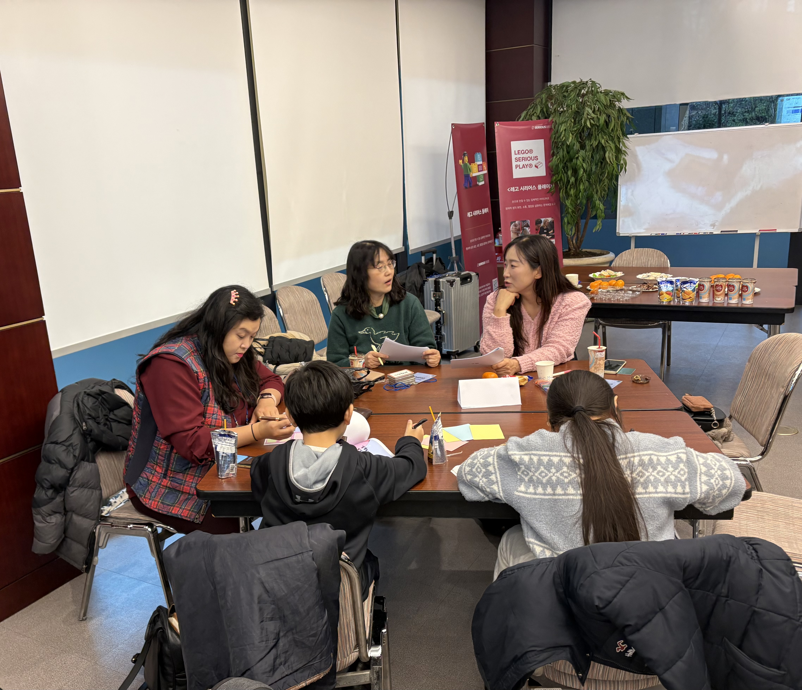
  
  
  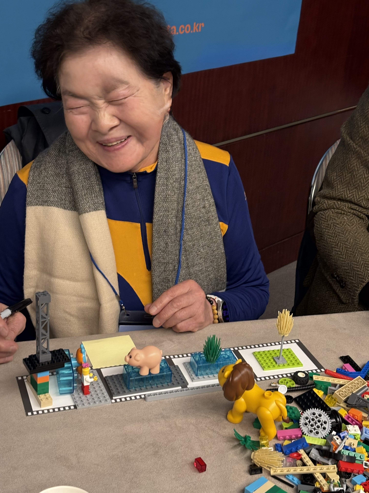
  
  

---

## Ⅳ. 총평

### 📊 피드백

<strong>👨‍🏫 강사진 피드백</strong>

#### 권대욱

나의 참여후기 | 리셋 2026

'리셋'이라는 단어는

무언가를 지우는 일이 아니라

다시 바라보는 일이라는 생각이 들었습니다.

이번 리셋 2026은

앞으로 무엇을 더 할 것인가보다

무엇을 내려놓고, 무엇을 남길 것인가를

스스로에게 묻는 시간이었습니다.

오랜 시간 현장에서 조직을 이끌고,

사람을 만나고, 교육을 해오면서

나는 늘 '앞으로'만을 향해 달려왔습니다.

하지만 이 자리에서는

속도를 늦추고

나 자신을 다시 점검하게 되었습니다.

특히 인상 깊었던 것은

'쉼'이 단절이 아니라

다음 도약을 위한 준비라는 메시지였습니다.

쉼 속에서야 비로소

나의 언어와 방향이 또렷해졌습니다.

리셋 2026은

거창한 해답을 주기보다

각자가 자신의 질문을 품고 돌아가게 하는

성숙한 자리였습니다.

이런 만남이

일회성 이벤트로 끝나지 않고

지속적인 사유와 연결로 이어지기를 바랍니다.

나에게 리셋 2026은

멈춤을 허락한 자리이자

다시 출발선에 서게 한 시간으로 남았습니다.

#### 송성원

지난 주말, 여러 공간에서 LSP(레고 시리어스 플레이) 프로그램이 동시에 진행되었습니다. 🧱

어떤 곳에서는 엄마와 자녀가 함께하는 공감 워크숍을 통해 서로를 이해하고 마음을 잇는 시간이 있었고, 또 다른 곳에서는 레고조이 포럼을 통해 학대와 상처의 경험을 나누며 아이들의 꿈과 가능성을 응원하는 자리가 마련되었습니다.

그중에서도 타워팰리스에서 열린 「Re:Set 2026」은 차원이 다른 감동으로 마음에 깊이 남았습니다. ✨

총 3시간으로 구성된 풍성한 프로그램 가운데, 약 40분간 레고 세션을 직접 운영하였습니다.

레고 프로그램을 간단히 소개한 후, '가장 행복하고 기뻤던 순간'을 주제로 인생네컷을 레고로 표현하고, 각자의 이야기를 나누는 시간을 가졌습니다.

"2025년을 따뜻하게 기억하고, 2026년을 의미 있게 설계한다"는 "Re:Set 2026"의 취지처럼, 이 40분의 시간 동안만큼은 성과나 목표가 아닌 순수한 행복의 기억이 주인공이었습니다.

자신의 소중한 순간을 꺼내놓는 동안, 함께한 분들은 진심 어린 격려와 응원을 건넸고, 서로를 더 깊이 이해하는 따뜻한 시간이 자연스럽게 흘러갔습니다.

특히 인상 깊었던 장면은, 10세 이하의 아이들부터 80대 어르신까지, 무려 70년의 세월 차이를 지닌 분들이 한자리에 모였다는 사실이었습니다. 👶🏻👵🏻

기업 워크숍에서는 쉽게 보기 어려운 이 '세대 융합'이야말로 "Re:Set 2026"만의 가장 큰 매력이었습니다.

나이도, 삶의 배경도 다르지만

"올해를 잘 마무리하고, 새해를 의미 있게 맞이하고 싶다"는 마음만큼은 모두 같았습니다.

어린 아이의 순수한 꿈 이야기에 어르신의 눈시울이 붉어지고, 어르신의 깊이 있는 인생 이야기에 젊은 세대가 고개를 끄덕이는 모습 속에서 이 자리가 단순한 프로그램을 넘어 인생을 나누고 서로를 위로하는 치유의 공간임을 느낄 수 있었습니다. 

3시간의 여정 중 짧지만 강렬했던 40분의 레고 시간이 전체 프로그램에 특별한 깊이와 의미를 더해주었습니다.

레고 블록 하나하나에 담긴 진심이 모여 하나의 아름다운 작품이 되듯, 우리 각자의 이야기 또한 서로를 더 풍성하게 만들어가고 있습니다.

늘 응원합니다. ✨

#ReSet2026 #신여윤코치 #여유코치 #타워팰리스 #LSP레고 #레고시리어스플레이 #인생네컷
#세대융합 #2025마무리 #2026비전설계
#레고코칭 #소통과공감 #치유와위로 #함께하는행복

#### 나무선

티키타카 두 분이 운영하는 코칭수업에 초대되어 설레는 마음으로 수업날을 기다렸습니다. 

그런데 기억의 왜곡 때문에 당일 12시에야 수업이 2시에 시작한다는 것을 알게 되었지요. 더군다나 자동차를 가지고 나간 효담 님은 12시 50분 경에나 들어왔지요. 오후에는 대설주의보 눈소식도 있고 사면초가의 심정이었습니다. 서울 도착해 차를 주차하고야 안 사실이지만 스마트키 없이 주행했었습니다. 만일 휴게소에서 시동을 껐다면 토요일 일정은 거기서 멈출 수밖에 없었습니다. 

순서를 뒤로 미루어 터득골 이야기와 짧은 삶디자인학교 이야기를 나눌 수 있었습니다. 다행이 여유 님의 능숙한 진행 솜씨 덕에 권대욱 강사님의 순서가 먼저 진행되고 소원나무에 2026년의 리셋이 진행된 후 제 이야기를 시작할 수 있었지요. 그날 제가 하고 싶었던 이야기는 소원에 수반되는 어려움을 만나는 관점에 대한 것이라 오히려 잘 된 듯 싶습니다. 

가족끼리 온 테이블에서 어린이 둘이 인상에 남습니다. 인생이 늘 재밌고 어려운 게 없는 사람이 손 들라 하니 어린이 둘만 손을 들었지요. 분별없고 고정관념 없이 어린이처럼 순간순간에 집중하면 살아가는 게 순수의식이고 마음공부의 궁극이라면 그 두 어린이가 스승처럼 그 자리에 있었던 게 아닌가 싶습니다. 

수업이 진행된 타워팰리스 주민회의실도 많은 것을 느끼게 했습니다. 이런 코칭수업이 모든 아파트나 시골마을의 주민센터에서 진행된다면 그게 평생학습의 이상적인 모습 아닐까 하는. 티키타카 두 분이 전국의 주민센터에서 삶을 성찰하는 코칭 프로그램으로 붐비게 하는 동력을 불어넣을 것을 상상하면서 큰 박수를 보냅니다.

<strong>👥 관계자 피드백</strong>

#### 타마

✅ Re:set 2026을 마치고
이 자리가 단순한 연말 워크샵이 아니라 코칭제타라는 커뮤니티가 만들어온 시간의 결실이었다는 생각이 들었습니다.  
석 달 전, 이 곳 같은 장소, 같은 시간 동안 "나는 철들지 않기로 했다" 북토크를 진행했을 때
우리는 막연히 '다음'을 기약했습니다. 그리고 그 약속이 올해의 마지막을 함께 정리하고 새해를 설계하는 Re:set 2026이라는 형태로 다시 여러분을 뵙게 되었습니다.  
사실 이번 행사를 준비하면서 여러 고민이 있었습니다. 당초 11월 29일 예정이었던 일정이 12월로 미뤄지면서 연말 모임이 가장 바쁜 시기에 접어들었고, 행사 당일 대설주의보가 발령된 궃은 날씨까지 겹쳐 마음이 무거웠습니다. 하지만 22명의 신청자 중 20명이나 되는 분들이 그 모든 조건에도 불구하고 이 자리를 함께 해주셨습니다.  
그 신뢰와 기대에 진심으로 감사했고, 동시에 더 큰 책임감을 느꼈습니다. 코칭제타를 시작하며 우리가 꿈꿨던 것은 단순히 정보를 전달하는 강의가 아니라 서로의 삶을 나누고 함께 성장하는 커뮤니티였습니다. 이번 Re:set 2026은 바로 그 본질을 확인하는 자리였습니다.  
10세 미만의 어린이부터 80대 어르신까지 각자의 2025년을 돌아보고 2026년을 설계하는 모습에서
우리가 만들고자 했던 '나이와 배경을 넘어선 연결'이 현실이 되는 것을 보았습니다.  
권대욱 대표님, 송성원 대표님, 나무선 대표님 세 분의 강연을 통해 각각의 전문성과 삶의 지혜로 프로그램에 깊이를 더해주셨고, 여유 코치와 함께 3시간의 여정을 설계하고 진행하며
'함께 만드는 워크샵'의 의미를 다시 한번 마음에 새겨보는 시간이었었습니다.  
물심양면으로 애써주신 강사진분들, 준비 과정에서 도움을 주신 모든 분들, 그리고 무엇보다
이 자리를 믿고 찾아와주신 참가자 한 분 한 분께 진심으로 감사드립니다.  
2026년 새해에는 이런 오프라인 모임을 통해 정례적으로 좀 더 자주 뵙기를 희망합니다.

Re:set은 끝이 아니라 시작입니다. 
코칭제타와 함께 여러분의 2026년이 의미 있는 한 해가 되기를 응원합니다. 
함께 해주셔서 감사합니다. 🙏

#### 여유

💡여유

Re:set 2026을 무사히 마치고 나니
무엇보다 '함께'라는 말의 무게가 새삼 다르게 느껴집니다. 

이번 행사를 준비하면서 가장 고민했던 지점은 "과연 연말 바쁜 시기에, 7만원이라는 참가비를 내고, 토요일 오후 3시간이라는 시간을 기꺼이 내어줄 분들이 계실까"하는 것이었습니다.
더군다나 당초 11월 29일에서 12월로 일정이 미뤄지면서 연말 모임이 겹치는 시기가 되었고, 행사 당일에는 대설주의보까지 발령되어 솔직히 마음이 무겁기도 했습니다. 

하지만 그 자리에 모인 분들의 진심이
프로그램 내내 공간을 채웠습니다. 특히 인상 깊었던 것은 이 자리가 단순히 '워크샵 참여'를 넘어서 각자의 삶을 나누고 서로를 응원하는 진짜 커뮤니티의 장이 되었다는 점입니다. 

10세 미만의 어린이부터 80대 어르신까지 70년의 세월 차이를 가진 분들이
같은 공간에서 같은 주제로 이야기를 나눴다는 것. 기업 워크샵에서는 경험하기 어려운 이 '세대를 초월한 연결'이 Re:set 2026만의 가장 큰 자산이었습니다. 

권대욱 강사님의 깊이 있는 통찰, 송성원 코치님의 따뜻한 레고 세션, 나무선 코치님의 삶의 지혜가 각각의 시간대에 조화롭게 어우러지면서 참가자들은 자신의 2025년을 돌아보고 2026년을 설계하는 진정한 'Re:set'의 시간을 가질 수 있었습니다. 

진행자로서 가장 보람찼던 순간은 참가자들이 서로의 이야기에 진심으로 귀 기울이고 공감하고 격려하는 모습을 보았을 때였습니다. 누군가의 행복한 기억에 함께 웃고, 누군가의 다짐에 박수를 보내는 그 자연스러운 연대감 속에서 코칭제타가 지향하는 '함께 성장하는 커뮤니티'의 본질을 확인할 수 있었습니다. 

2026년에는 이런 오프라인 모임을
좀 더 정례화해서 부담 없이, 그러나 의미 있게 서로를 만나고 연결될 수 있는 지속 가능한 장을 만들어가고 싶습니다. 새해에는 더 성숙하고 따뜻한 만남으로 다시 찾아뵙겠습니다. 함께 해주셔서 감사했습니다.

<strong>💬 참가자 피드백</strong>

  
  
  
  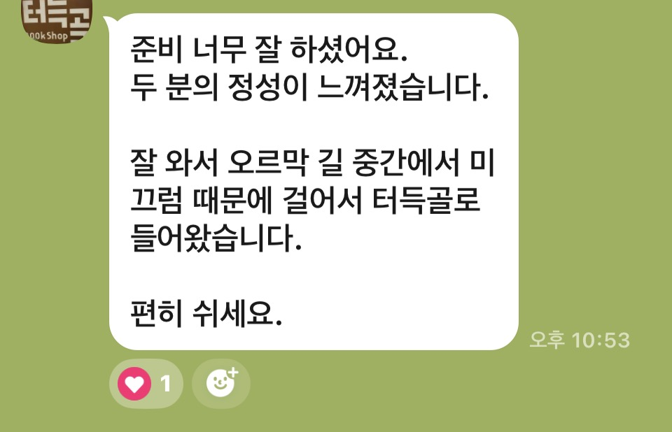
  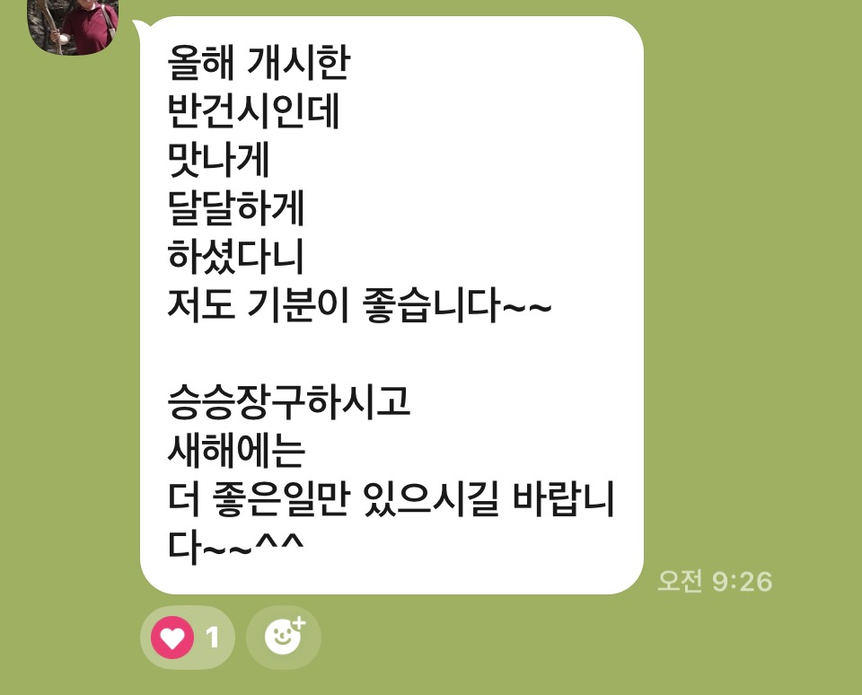
  
  
  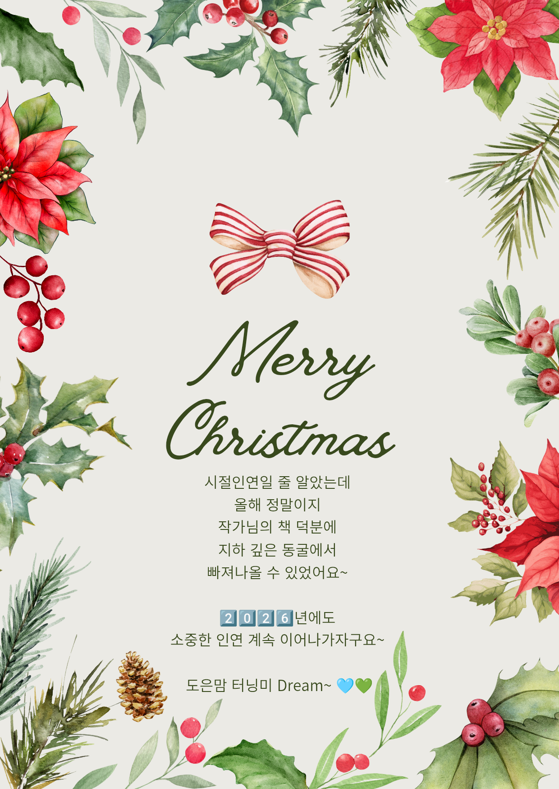

---

### 🎬 포스터

  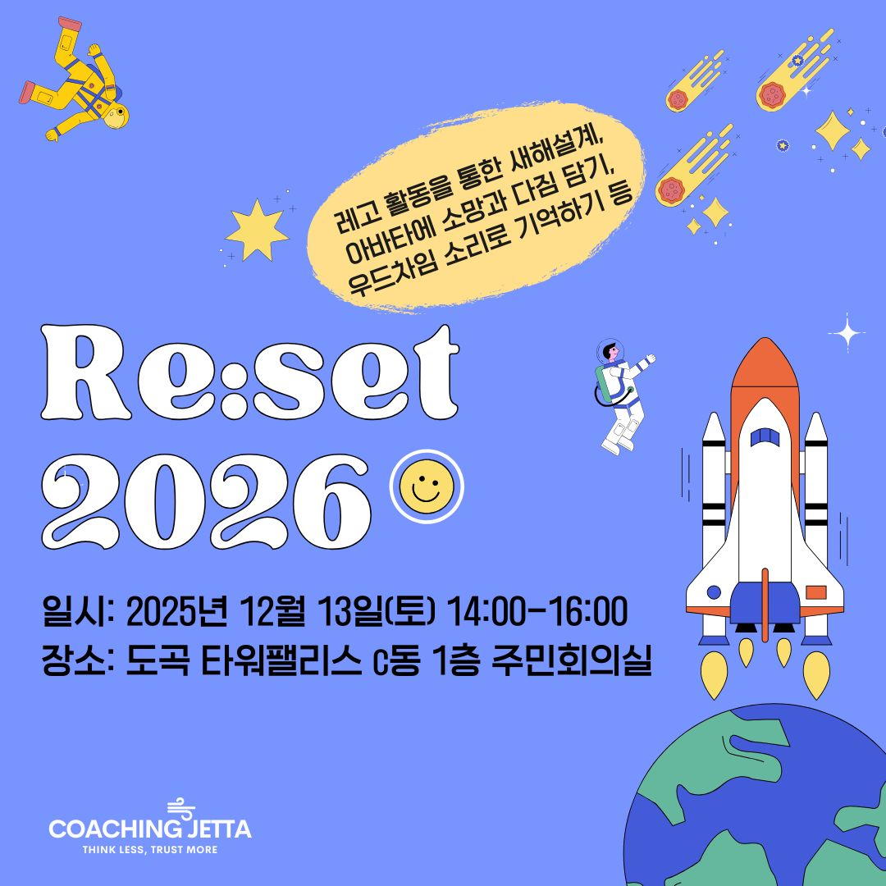
  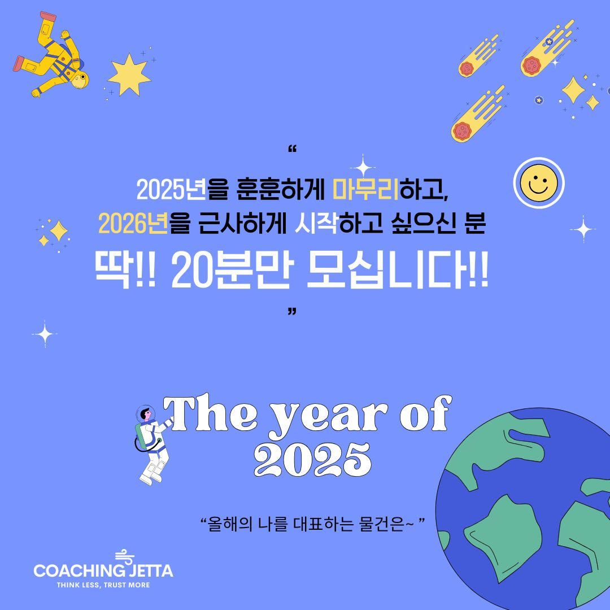
  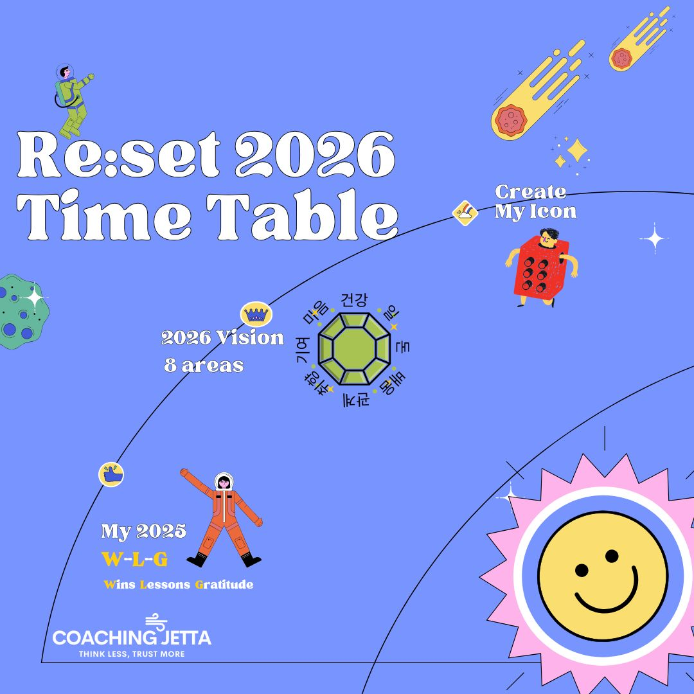
  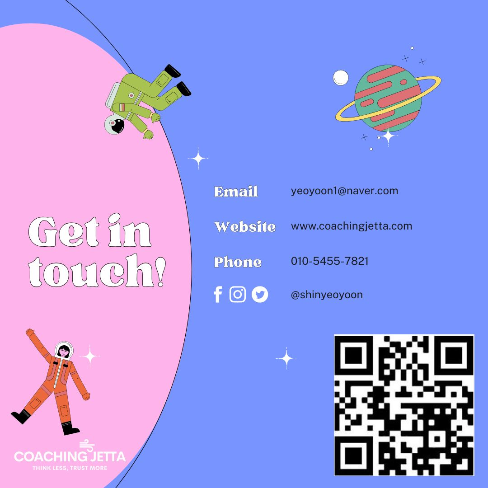

---

  <h3 style="margin-top: 0;">🎉 성공적인 강연을 위해 참여해주신🎉  모든 분들께 감사드립니다!</h3>
  
다음 강연에서 또 만나요! 👋

